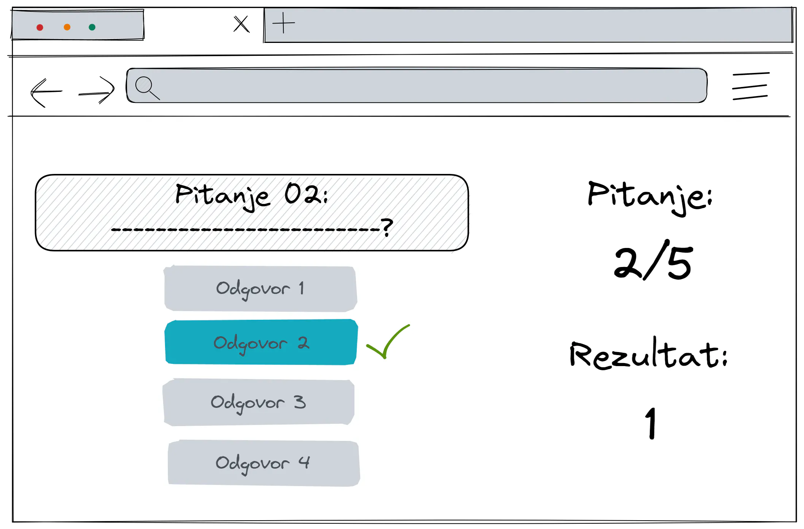

# Quiz

As part of my participation in the DD Junior Dev training program, I've developed this project to enhance and refine my IT skills.

---

### Table of content

- [Description](#item-one)
- [Features](#item-two)
- [Demo](#item-three)
- [Instalation](#item-four)
- [Technologies](#item-five)

<a id="item-one"></a>

## Description

The goal is to create quiz with basic features listed below. [Open Trivia DataBase](https://opentdb.com/api_config.php) JSON API was used for a database of quiz (trivia) questions.

The default design prototype is pictured below. My solution is shown in the Demo section.



<a id="item-two"></a>

## Features

- Add the ability to answer the current question and display whether the answer was correct or not ✅
- After answering, the next question is displayed ➡️
- Show the total number of questions and the current question number 📝
- Display the user's current score 🏆
- Offer the user the possibility to play again after the end of the game ♻️

## Advanced Features

- Offer the user the option to choose the difficulty, category or number of questions before starting the game ⚙️
- Depending on the user's input, modify the URL of the request and only after confirmation send the user the request and start the game with the requested set of questions 🔁

<a id="item-three"></a>

### Demo

<a id="item-four"></a>

### Instalation

In the project directory, you can run:

```bash
git clone git@github.com:srudic/quiz.git
cd quiz
npm install
npm run dev
```

After running these commands, you should be able to access the project locally at [localhost:port] in your web browser.

<a id="item-five"></a>

## Technologies

This project makes use of various technologies and libraries to bring its features to life. Here's a rundown of the key technologies and dependencies used:

- **React** ⚛️
- **React DOM** ⚛️
- **React Router Dom** 🌐 - Declarative routing for React applications.
- **Vite** 🚀
- **@mui/material** 📦 - A React UI framework for building responsive and accessible websites and applications.
- **axios** 📡 - A promise-based HTTP client for making requests to external APIs.
- **he** 💡 - A robust HTML entity encoder/decoder written in JavaScript.

_React + Vite_ - This combination provides a powerful toolset for fast and efficient development. Vite is a blazing fast build tool that pairs perfectly with React, offering features like Hot Module Replacement (HMR) for a seamless development experience.
